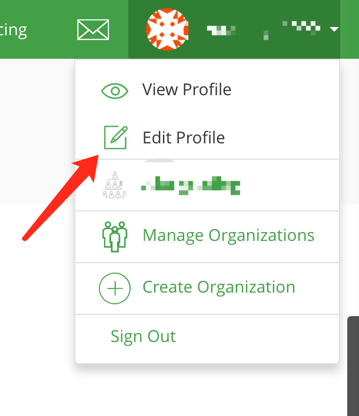
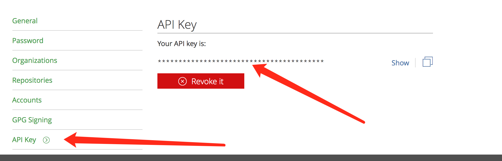

# bintrayhelper
update to bintray

> 一键帮助你上次 bintary

直接上手就是干
### 准备工作
* projet 中的 build.gradle 文件中加入 
    ```
    classpath 'com.jfrog.bintray.gradle:gradle-bintray-plugin:1.7.3'
    classpath 'com.github.dcendents:android-maven-gradle-plugin:1.5'
    ```
* 在您需要打包arr并上次bintray model 中 build.gradle 添加如下

    ```
        apply plugin: 'com.jfrog.bintray'
        apply plugin: 'com.github.dcendents.android-maven'
    ```
    基本配置
    ```
        if (project.hasProperty("android")) { // Android libraries
            task sourcesJar(type: Jar) {
                classifier = 'sources'
                from android.sourceSets.main.java.srcDirs
            }

           task javadoc(type: Javadoc) {
                source = android.sourceSets.main.java.srcDirs
                classpath += project.files(android.getBootClasspath().join(File.pathSeparator))
            }
        } else { // Java libraries
            task sourcesJar(type: Jar, dependsOn: classes) {
                classifier = 'sources'
                from sourceSets.main.allSource
            }
        }

        task javadocJar(type: Jar, dependsOn: javadoc) {
            classifier = 'javadoc'
            from javadoc.destinationDir
        }

        artifacts {
        //    archives javadocJar
            archives sourcesJar
        }

    ```
* *  继续添加
  ```
     version = libraryVersion   //① 版本号
        install {
            repositories.mavenInstaller {
                // This generates POM.xml with proper parameters
                pom {
                    project {
                        packaging 'aar'
                        // Add your description here
                        name libraryDescription    //②项目描述
                        url siteUrl
                        // Set your license
                        licenses {
                            license {
                                name 'The Apache Software License, Version 2.0'
                                url 'http://www.apache.org/licenses/LICENSE-2.0.txt'
                            }
                        }
                        artifactId artifact_Id    // ③artifactId
                        developers {
                            developer {
                                id developerId       //④ 开发者信息
                                name developerName      //④ 开发者信息
                                email developerEmail    //④ 开发者信息
                            }
                        }
                        scm {
                            connection gitUrl       //④ 开发者信息
                            developerConnection gitUrl  //④ 开发者信息
                            url siteUrl     //④ 开发者信息
                        }
                    }
                }
            }
        }

      

        // Bintray
        Properties properties = new Properties()
        properties.load(project.rootProject.file('local.properties').newDataInputStream())
        group = publishedGroupId   //⑥ groupid
        bintray {
            user = properties.getProperty("bintray.user")  //  bintray账号
            key = properties.getProperty("bintray.apikey")   //  bintray apikey

            configurations = ['archives']
            pkg {
                repo = bintrayRepo
                name = bintrayName
                desc = libraryDescription
                websiteUrl = siteUrl
                vcsUrl = gitUrl
                issueTrackerUrl = issueUrl
                licenses = allLicenses
                labels = alllabels
                publish = true
                publicDownloadNumbers = true
        //        githubReleaseNotesFile="README.md"
        //        githubRepo = 'bintray/gradle-bintray-plugin' //Optional Github repository
        //        githubReleaseNotesFile = 'README.md' //Optional Github readme file
                version {
                    desc = libraryDescription
                    gpg {
                        sign = true //Determines whether to GPG sign the files. The default is false
                        passphrase = properties.getProperty("bintray.gpg.password")
                        //Optional. The passphrase for GPG signing'
                    }
                }
            }
        }
  ```
    **以上部分都是配置到 model的 build.gradle 文件中**

#    开始操作
> 在local.properties 编写 (一般local.properties不开源的)
   ``` 
     bintray.user= xxxxxxx
     bintray.apikey=xxxxx
   ```
>  首先你需要bintray 账号 [bintray](https://bintray.com)

*  查找  bintray.apikey  
  
 
 

#  项目信息
 